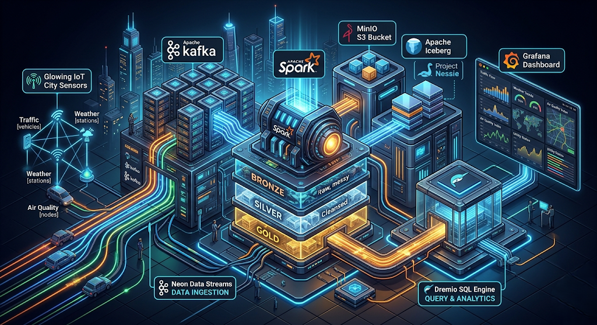
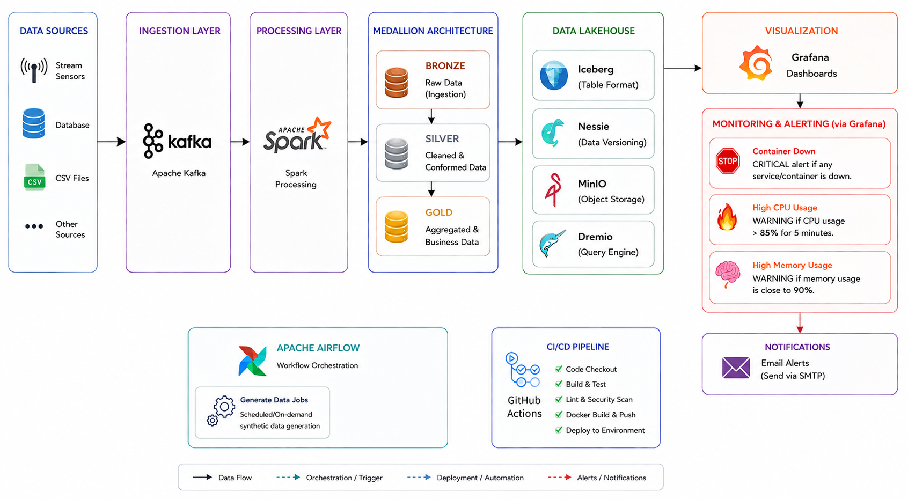
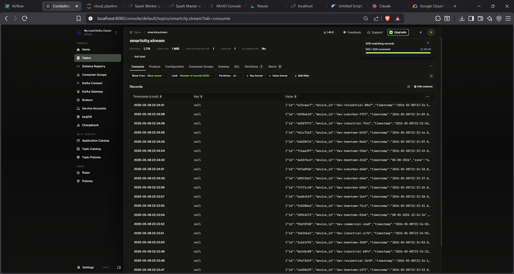
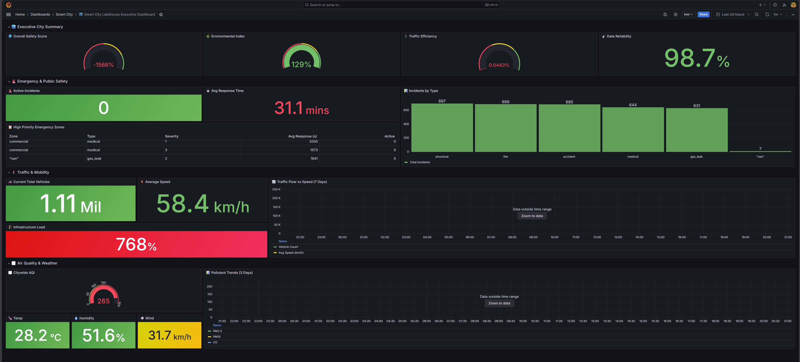
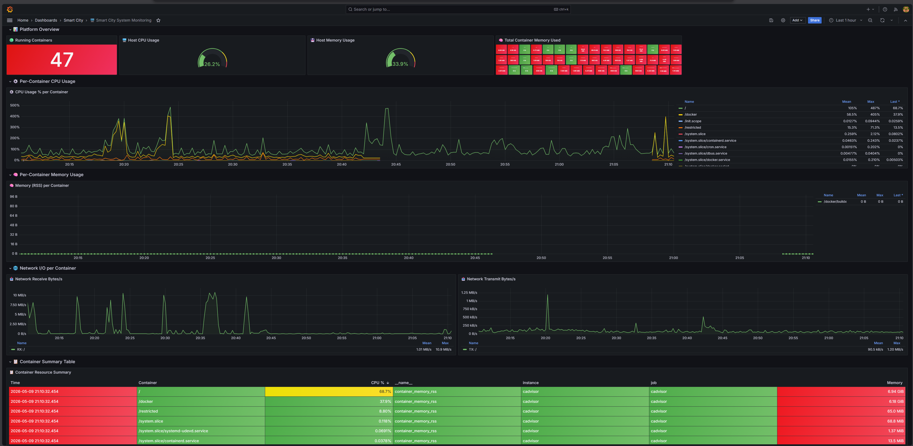

<div align="center">



# 🏙️ Smart City Data Lakehouse Platform

A state-of-the-art, **Enterprise Data Lakehouse** designed for high-velocity urban IoT telemetry. This platform transforms raw, noisy sensor data into high-fidelity analytical assets using a multi-stage **Medallion Architecture**, orchestrated by Apache Airflow, and governed by Apache Iceberg & Project Nessie.

[](https://www.python.org/)
[](https://spark.apache.org/)
[](https://kafka.apache.org/)
[](https://iceberg.apache.org/)
[](https://www.docker.com/)
[](https://github.com/shehab-hub-0/Smart_City_Data_Engineering_Project/actions)

</div>



---

## 📖 Project Overview

This platform ingests and cleanses simulated city events, transforming them into high-quality analytical datasets. It solves real-world IoT challenges such as sensor dropouts, data anomalies, format noise, and late-arriving records, outputting pristine data ready for Business Intelligence (BI) and AI predictions.

### 🌟 Key Features
- **Real-Time Streaming:** Continuous processing from Kafka using Spark Structured Streaming.
  
  

- **Git-like Data Versioning:** Cataloging and branch management powered by Project Nessie.
- **ACID Transactions:** Row-level Upserts (`MERGE INTO`) powered by Apache Iceberg v2.
- **Resilient Pipeline:** Implements domain-specific Imputation and Graceful Shutdowns (`Trigger.AvailableNow()`) for zero-data-loss incremental batches.
- **Professional Observability:** Full-stack monitoring with Prometheus, cAdvisor, and Grafana for both business metrics and system health.

  
  
  

---

## 📚 Documentation Directory

To dive deep into the technical implementation, please explore the detailed documentation modules below:

| Module | Description | Link |
| :--- | :--- | :--- |
| **01. Architecture** | High-level system design and data flow. | [01_Architecture_Overview.md](./documentation/01_Architecture_Overview.md) |
| **02. Infrastructure** | Containerization, network, and resource management. | [02_Infrastructure_Deep_Dive.md](./documentation/02_Infrastructure_Deep_Dive.md) |
| **03. Processing Layers** | The Bronze, Silver, and Gold transformations. | [03_Data_Processing_Layers.md](./documentation/03_Data_Processing_Layers.md) |
| **04. Orchestration** | Airflow DAGs and task scheduling. | [04_Orchestration_Airflow.md](./documentation/04_Orchestration_Airflow.md) |
| **05. Lakehouse Storage** | Deep dive into Iceberg formats and Nessie cataloging. | [05_Data_Lakehouse_Nessie_Iceberg.md](./documentation/05_Data_Lakehouse_Nessie_Iceberg.md) |
| **06. Operations** | Troubleshooting and system setup guide. | [06_Setup_and_Troubleshooting.md](./documentation/06_Setup_and_Troubleshooting.md) |
| **ER Diagram** | Complete Data Model with all table columns. | [lakehouse_er_diagram.md](./documentation/lakehouse_er_diagram.md) |

---

## 🚀 Quick Start Guide

### 1. Spin Up the Infrastructure
The entire platform is containerized. Start the environment using Docker Compose:
```bash
docker compose up -d
```
*(Note: Ensure Docker Desktop is allocated at least 8GB RAM and 4 CPU cores for optimal performance).*

### 2. Start Data Generators
In a separate terminal, launch the Kafka producers to simulate city traffic, weather, and emergencies:
```bash
python scripts/data/producers/main.py --mode stream
```

### 3. Run the Pipelines
The ETL logic is contained within `notebooks/pipeline/`. You can execute each layer using the unified `submit.py` script:

```bash
# Terminal 1: Run the Bronze Ingestion (Streaming)
python notebooks/pipeline/submit.py bronze

# Terminal 2: Run the Silver Cleansing (Streaming)
python notebooks/pipeline/submit.py silver

# Terminal 3: Run the Gold Aggregation (Incremental Batch)
python notebooks/pipeline/submit.py gold --mode batch
```

---

## 📂 Project Structure
- `/dags`: Airflow DAG definitions.
- `/scripts/spark_jobs`: Core ETL logic (Bronze, Silver, Gold).
- `/data_sources`: Data generators and Kafka producers.
- `/config`: Configuration files for Spark and Postgres.
- `docker-compose.yml`: Infrastructure orchestration.
---

## 📚 Deep Dive Documentation
For a complete guide on how this platform is built and managed, visit the **[Documentation Index](./documentation/README.md)**.

<div align="center">
<i>Built for the future of urban analytics.</i>
</div>
