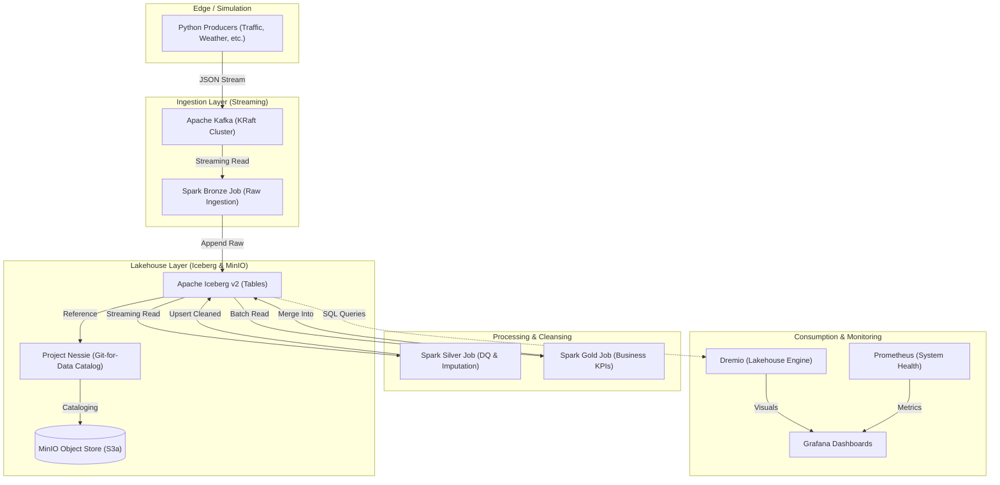

## 🗺️ Data Flow & Topology

The platform follows a unidirectional flow from Edge/IoT simulation to high-performance analytics.

---

## 💎 The Medallion Standard

This project implements a strict Medallion Architecture to decouple ingestion from business logic:

1. **Bronze (Raw):** Stores raw events from Kafka exactly as they arrive. This ensures we can always "re-play" history if our cleansing logic changes.
2. **Silver (Fact/Dim):** The most complex layer. It performs schema enforcement, replaces sensor outliers (Clamping), imputes missing values using domain-specific rules, and standardizes timestamps across all city zones.
3. **Gold (Business):** Highly summarized datasets. These tables are optimized for BI tools and represent the final "Truth" for city officials.

> [!TIP]
> For a full list of all tables, columns, and relationships, refer to the [Entity-Relationship (ER) Diagram](./lakehouse_er_diagram.md).

---

## 🛠️ The Tech Stack

| Technology | Role |
| :--- | :--- |
| **Apache Spark** | The primary engine for large-scale data processing (Streaming & Incremental Batch). |
| **Apache Kafka** | Distributed message broker for real-time data ingestion. |
| **MinIO** | S3-compatible Object Storage acting as the Data Lake. |
| **Apache Iceberg v2** | High-performance table format enabling ACID `MERGE INTO` operations. |
| **Project Nessie** | Transactional catalog providing Git-like branching for our Data Lakehouse. |
| **Apache Airflow** | Orchestration engine to schedule maintenance tasks and batch processing. |
| **Dremio** | SQL Lakehouse Platform for ultra-fast BI querying directly on Iceberg. |

---

## 📂 Key Directory Structure

- `docker-compose.yml`: Infrastructure definitions.
- `dags/`: Airflow DAG definitions for automation and resets.
- `data/`: Data producers, schemas, and simulation scripts.
- `notebooks/pipeline/`: Core Spark processing logic (Bronze, Silver, Gold).
- `config/`: Pipeline environment variables and constants.

> [!NOTE]
> Next Step: Learn how the containers communicate in the **[🖥️ Infrastructure Deep Dive](./02_Infrastructure_Deep_Dive.md)**.
