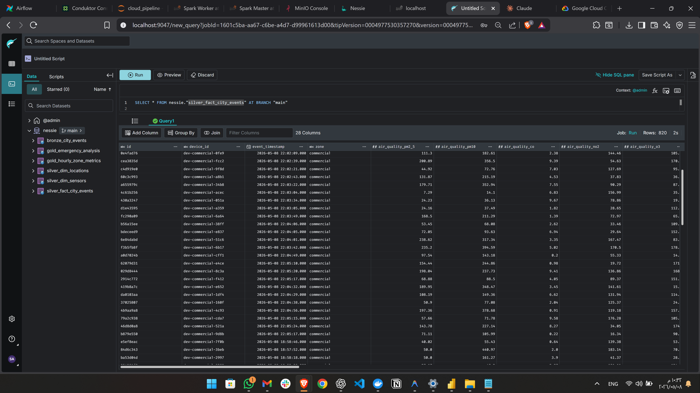
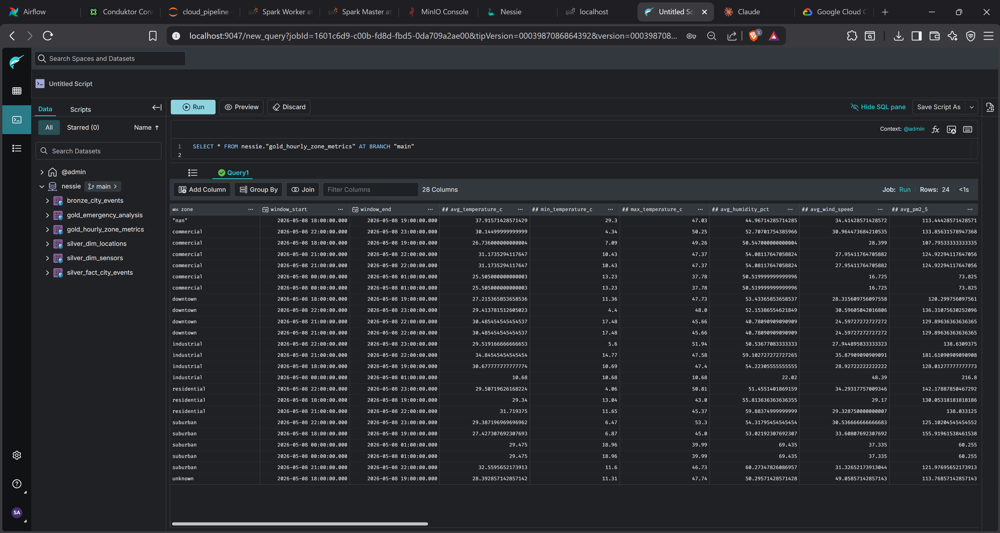

# 💎 Data Processing Layers (Medallion Architecture)

The project follows the Medallion methodology to ensure that raw data is transformed into high-quality, actionable insights.

---

## 🥉 Bronze Layer (Raw Data)
**Goal:** Capture data from Kafka and persist it as quickly as possible with minimal changes.

-   **Source:** Kafka Topics (`smartcity.stream`, `smartcity.batch`).
-   **Process:**
    -   Stream data in JSON format.
    -   Append technical metadata: `_ingested_at`, `_source_topic`.
    -   Store in Apache Iceberg format as `nessie.bronze_city_events`.
-   **Benefit:** Provides a "source of truth" to re-process data if downstream logic changes.

---

## 🥈 Silver Layer (Cleansed Data)
**Goal:** Transform raw data into a clean, typed, and standardized format.



-   **Key Operations:**
    1.  **Flattening:** Extracting nested values from JSON into relational columns.
    2.  **Type Casting:** Converting strings to appropriate types (Integer, Double, Timestamp).
    3.  **Cleansing & Clamping:**
        -   **Timestamp Parsing:** Handling various non-standard timestamp formats safely into ISO timestamps.
        -   **Text Standardization:** Trimming whitespaces and lowercasing categorical strings.
        -   **Clamping Outliers:** Enforcing strict physical bounds on numeric values (e.g., Temperature clamped to `0–55°C`, PM2.5 clamped to `0-500`) to fix sensor drift and GPS glitches.
        -   **Sensible Defaults:** Replacing `NULL` fields intelligently (e.g., missing condition becomes `"unknown"`) without corrupting zeros.
    4.  **Deduplication:** Using unique event `id` to ensure no double-counting within the watermark window.
    5.  **Data Quality (DQ):** Validating null rates and schema integrity.

---

## 🥇 Gold Layer (Business Insights)
**Goal:** Compute final KPIs and aggregates for decision-makers.



The Gold layer consists of two primary tables:
1.  **Hourly Zone Metrics (`gold_hourly_zone_metrics`):**
    -   Aggregates data every hour per zone.
    -   Computes: Avg Temperature, Avg Air Quality, Total Vehicle Count.
    -   Uses **MERGE INTO** (Upsert) logic to update existing windows.
2.  **Emergency Analysis (`gold_emergency_analysis`):**
    -   Focused on critical incidents.
    -   Computes: Avg response times and incident counts by severity.

---

## 🚀 Manual Execution

Use the `submit.py` script to launch any layer from the pipeline directory:
```bash
# Start Bronze Ingestion
python notebooks/pipeline/submit.py bronze

# Start Silver Cleansing
python notebooks/pipeline/submit.py silver

# Run Gold Aggregation (Batch Mode)
python notebooks/pipeline/submit.py gold --mode batch
```

---

## 🛡️ Data Quality & Resilience

The platform implements several "Safe-Guards" to ensure the pipeline never fails silently:

1.  **Late-Arriving Data:** Handled via **Watermarking** (10-minute window). Events arriving within this window are processed correctly; those later are dropped to maintain performance.
2.  **Graceful Shutdowns:** Spark jobs use `Trigger.AvailableNow()` to process all pending data before stopping, ensuring zero data loss during maintenance.
3.  **Transactional Integrity:** Powered by **Apache Iceberg v2**. Every write is an ACID transaction. If a job fails mid-way, the table remains in its last known good state.
4.  **Imputation Logic:** Missing sensor data is not just "dropped"—it is imputed using zone-specific moving averages to maintain statistical significance for the Gold layer.

---

> [!NOTE]
> Next Step: Understand the storage engine in **[❄️ The Data Lakehouse (Nessie & Iceberg)](./05_Data_Lakehouse_Nessie_Iceberg.md)**.

[⬅️ Back to Index](./README.md)
