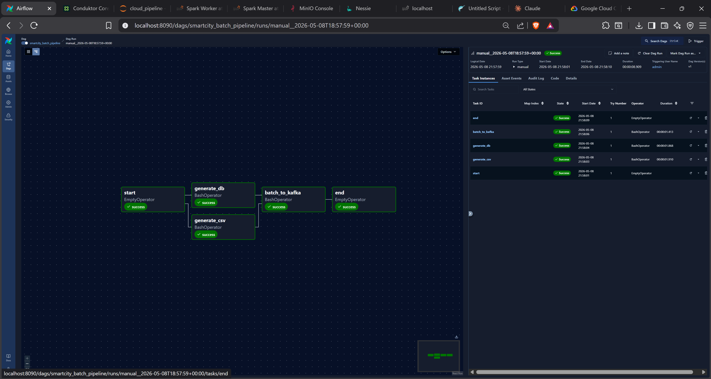

# 🎼 Orchestration with Apache Airflow

**Apache Airflow** acts as the "Conductor" for the project, organizing pipeline execution and ensuring tasks are run on schedule with proper dependency management.

---

## 🛠️ How Airflow is used in this Project

Instead of running scripts manually, we use **DAGs** (Directed Acyclic Graphs). In this project, we primarily use Airflow for Gold layer updates and maintenance tasks.

### 1. Main DAG: `smartcity_batch_pipeline`
This DAG manages batch-oriented tasks:
-   **Tasks:**
    -   `run_gold_layer`: Triggers the Gold aggregation logic.
    -   `run_maintenance`: Performs Iceberg metadata cleanup, snapshot expiry, and data compaction.
-   **Schedule:** Runs every 15 minutes (configurable).

### 2. Spark Integration
Airflow uses the `SparkSubmitOperator` to communicate with the Spark Master:
-   A connection named `spark_default` is pre-configured.
-   Airflow submits the code files and JAR dependencies to the cluster for execution.

---

## 📊 Airflow UI

Accessible via `http://localhost:8090`:
-   **Username:** `admin`
-   **Password:** `admin`

**Key Features:**
-   **Execution Monitoring:** Visualize when each pipeline started and finished.
-   **Retries:** If a task fails (e.g., due to a temporary network issue), you can retry it with a single click.
-   **Logging:** Detailed console output for every task, essential for debugging.

---

## 🏗️ Environment Setup (Airflow Init)

During the initial `docker-compose up`, the `airflow-init` service:
1.  Migrates the database schema.
2.  Creates the admin user.
3.  Automatically defines the Spark cluster connection.

---

## 🚀 CI/CD Pipeline (GitHub Actions)

The project includes a production-grade CI pipeline (`.github/workflows/ci.yml`) that automates code quality checks:
-   **Python Linting:** Ensures code follows PEP8 standards using `flake8`.
-   **DAG Validation:** Automatically parses all Airflow DAGs to catch syntax errors before deployment.
-   **Dockerfile Linting:** Checks for best practices in all Docker images using `hadolint`.
-   **Config Validation:** Ensures all YAML and environment files are syntactically correct.

> [!NOTE]
> The pipeline is configured to use **Airflow 3.1.2** for validation to match the project's modern environment.

---

> [!TIP]
> It is recommended to keep Bronze and Silver as continuous "Streaming" jobs outside of Airflow (or as long-running tasks), while Airflow handles periodic Batch and Maintenance jobs.
