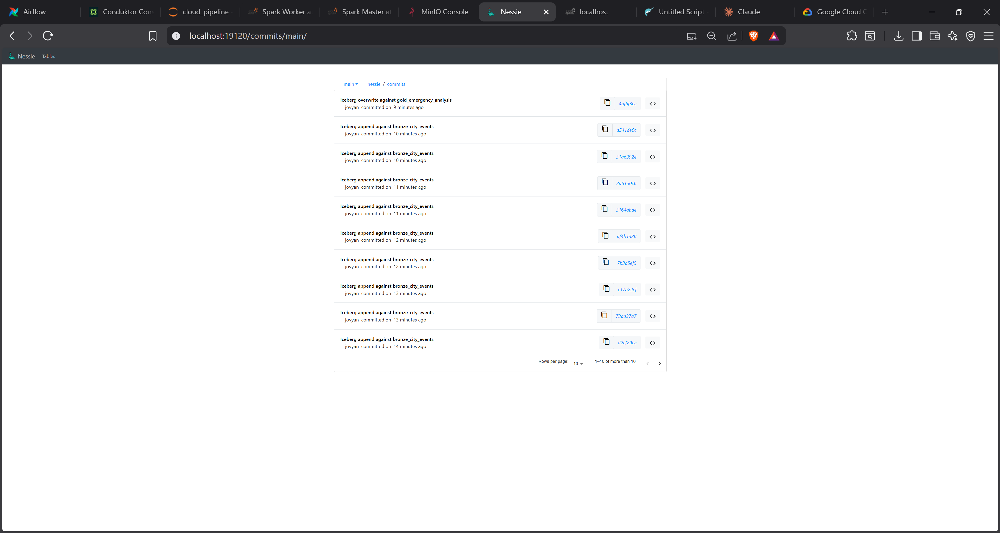

# ❄️ The Data Lakehouse (Nessie & Iceberg)

This project leverages the **Data Lakehouse** architecture, combining the cost-effectiveness of a Data Lake with the management capabilities of a Data Warehouse.

---

## 🏗️ What is Apache Iceberg?
It is an open table format for huge analytic datasets stored in object storage (MinIO).
-   **Why use it?**
    -   **ACID Transactions:** Ensures data integrity; writes either succeed fully or fail completely.
    -   **Schema Evolution:** Add, drop, or rename columns without rewriting the entire table.
    -   **Partition Evolution:** Change partitioning (e.g., from daily to hourly) without breaking existing queries.
    -   **Time Travel:** Query the database as it was at a specific point in time or snapshot ID.

---

## 🐙 What is Project Nessie?
Nessie acts as the transactional catalog for Iceberg, providing **Git-like versioning** for your data.



### Revolutionary Features:
1.  **Branching:** Create a `dev` branch to test a new pipeline without affecting the `main` branch seen by production users.
2.  **Commits:** Every write is a commit. You can rollback to any previous commit if bad data is ingested.
3.  **Merging:** Once a `dev` branch is validated, merge it into `main` to promote changes to production.

---

## 🛠️ Interacting with Nessie in Code

The catalog is defined in `spark_session.py` and `settings.py`:
```python
.config("spark.sql.catalog.nessie", "org.apache.iceberg.spark.SparkCatalog")
.config("spark.sql.catalog.nessie.catalog-impl", "org.apache.iceberg.nessie.NessieCatalog")
.config("spark.sql.catalog.nessie.ref", "main") # Default branch
```

You can use SQL to interact with the catalog:
```sql
-- Create a new branch
CREATE BRANCH dev IN nessie;

-- Query from an old snapshot
SELECT * FROM nessie.silver_city_events FOR TIMESTAMP AS OF '2026-05-01 10:00:00';
```

---

---

> [!NOTE]
> Next Step: Finalize your installation in the **[🚀 Setup & Troubleshooting Guide](./06_Setup_and_Troubleshooting.md)**.

[⬅️ Back to Index](./README.md)
