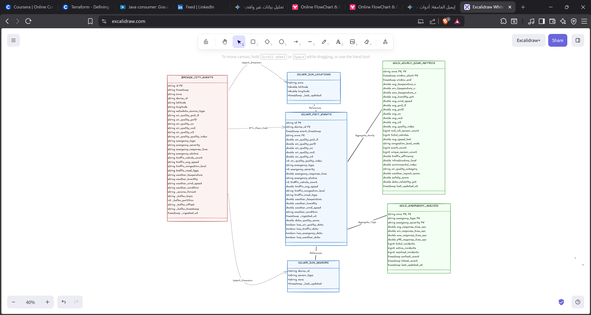

# Smart City Lakehouse Data Architecture

This diagram illustrates the flow and relationship of data across the Bronze, Silver, and Gold layers of the Lakehouse architecture.

```mermaid
erDiagram
    %% BRONZE LAYER
    BRONZE_CITY_EVENTS {
        string id PK
        string timestamp
        string zone
        string device_id
        string latitude
        string longitude
        string metadata_source_type
        string air_quality_pm2_5
        string air_quality_pm10
        string air_quality_co
        string air_quality_no2
        string air_quality_o3
        string air_quality_quality_index
        string emergency_type
        string emergency_severity
        string emergency_response_time
        string emergency_status
        string traffic_vehicle_count
        string traffic_avg_speed
        string traffic_congestion_level
        string traffic_road_type
        string weather_temperature
        string weather_humidity
        string weather_wind_speed
        string weather_condition
        string _source_format
        string _kafka_topic
        int _kafka_partition
        string _kafka_offset
        string _kafka_timestamp
        timestamp _ingested_at
    }

    %% SILVER LAYER (Star Schema)
    SILVER_DIM_LOCATIONS {
        string zone PK
        double latitude
        double longitude
        timestamp _last_updated
    }

    SILVER_DIM_SENSORS {
        string device_id PK
        string sensor_type
        string zone FK
        timestamp _last_updated
    }

    SILVER_FACT_EVENTS {
        string id PK
        string device_id FK
        timestamp event_timestamp
        string zone FK
        double air_quality_pm2_5
        double air_quality_pm10
        double air_quality_co
        double air_quality_no2
        double air_quality_o3
        int air_quality_quality_index
        string emergency_type
        int emergency_severity
        double emergency_response_time
        string emergency_status
        int traffic_vehicle_count
        double traffic_avg_speed
        string traffic_congestion_level
        string traffic_road_type
        double weather_temperature
        double weather_humidity
        double weather_wind_speed
        string weather_condition
        timestamp _ingested_at
        double data_quality_score
        boolean has_air_quality_data
        boolean has_traffic_data
        boolean has_emergency_data
        boolean has_weather_data
    }

    %% GOLD LAYER
    GOLD_HOURLY_ZONE_METRICS {
        string zone PK, FK
        timestamp window_start PK
        timestamp window_end
        double avg_temperature_c
        double min_temperature_c
        double max_temperature_c
        double avg_humidity_pct
        double avg_wind_speed
        double avg_pm2_5
        double avg_pm10
        double avg_co
        double avg_no2
        double avg_o3
        double avg_quality_index
        bigint no2_o3_sensor_count
        bigint total_vehicles
        double avg_speed_kmh
        string congestion_level_mode
        bigint event_count
        bigint unique_sensor_count
        double traffic_efficiency
        double infrastructure_load
        double environmental_index
        string air_quality_category
        double weather_impact_score
        double safety_score
        double data_reliability_pct
        timestamp last_updated_at
    }

    GOLD_EMERGENCY_ANALYSIS {
        string zone PK, FK
        string emergency_type PK
        string emergency_severity PK
        double avg_response_time_sec
        double min_response_time_sec
        double max_response_time_sec
        double p95_response_time_sec
        bigint total_incidents
        bigint active_incidents
        bigint resolved_incidents
        timestamp earliest_event
        timestamp latest_event
        timestamp last_updated_at
    }

    %% RELATIONSHIPS
    BRONZE_CITY_EVENTS ||--o{ SILVER_FACT_EVENTS : "Cleansed & Validated"
    BRONZE_CITY_EVENTS ||--o{ SILVER_DIM_LOCATIONS : "Extracted Locations"
    BRONZE_CITY_EVENTS ||--o{ SILVER_DIM_SENSORS : "Extracted Sensors"

    SILVER_DIM_LOCATIONS ||--o{ SILVER_FACT_EVENTS : "Filters by Zone"
    SILVER_DIM_SENSORS ||--o{ SILVER_FACT_EVENTS : "Filters by Sensor"
    SILVER_DIM_LOCATIONS ||--o{ SILVER_DIM_SENSORS : "Locates"

    SILVER_FACT_EVENTS ||--o{ GOLD_HOURLY_ZONE_METRICS : "Aggregated Hourly"
    SILVER_FACT_EVENTS ||--o{ GOLD_EMERGENCY_ANALYSIS : "Aggregated by Type/Severity"
    
    SILVER_DIM_LOCATIONS ||--o{ GOLD_HOURLY_ZONE_METRICS : "Dimensions"
    SILVER_DIM_LOCATIONS ||--o{ GOLD_EMERGENCY_ANALYSIS : "Dimensions"
```

### 📋 شرح المخطط (ER Diagram Explanation):

1. **الطبقة البرونزية (Bronze Layer):**
   * `BRONZE_CITY_EVENTS`: جدول تفريغ البيانات الخام (Landing Zone) القادمة من Kafka. جميع الحقول عبارة عن نصوص (Strings) غير معالجة للحفاظ على شكلها الأصلي بالإضافة لبيانات الـ Kafka Metadata.

2. **الطبقة الفضية (Silver Layer) - تصميم النجمة (Star Schema):**
   * `SILVER_FACT_EVENTS`: جدول الحقائق المركزي. يحتوي على الأحداث بعد التنظيف وتعديل الأنواع (Casting) وإضافة `data_quality_score` وأعلام الأنواع (Flags). يرتبط بجدول الأبعاد عبر `device_id` و `zone`.
   * `SILVER_DIM_LOCATIONS`: جدول أبعاد للمناطق (Zones). يضمن عدم التكرار للمواقع (Latitude/Longitude).
   * `SILVER_DIM_SENSORS`: جدول أبعاد للحساسات (Sensors). يربط كل حساس بنوع البيانات الذي يجمعه وبمنطقته.

3. **الطبقة الذهبية (Gold Layer):**
   * `GOLD_HOURLY_ZONE_METRICS`: يتم تجميع البيانات وتلخيصها كل ساعة بناءً على المنطقة `zone`. يحتوي على مقاييس أداء (KPIs) معقدة مثل مؤشر الأمان، كفاءة المرور، والبيئة.
   * `GOLD_EMERGENCY_ANALYSIS`: جدول تحليلي خاص بالطوارئ، يجمع البيانات حسب المنطقة، نوع الحدث، ودرجة الخطورة لمعرفة أوقات الاستجابة والحوادث النشطة والمنتهية.
